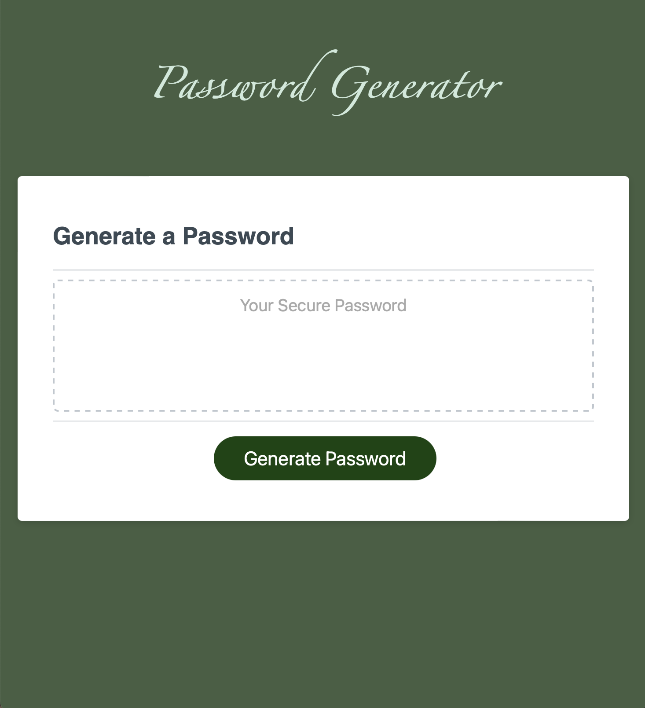

# Portfolio Page

This is a **random password generator** for creating secure, randomized passwords from scratch.

## Table of Contents

- [Background](#background)
- [Install](#install)
- [Usage](#usage)
- [Screenshot](#screenshot)
- [Maintainers](#maintainers)
- [Contributing](#contributing)
- [Contributors](#contributors)
- [License](#license)

## Background

*To incorporate the basics of Javascript with some challenging material,* we were instructed to create a password generator that could produce one at random, given user prompts. The prompts included number of characters, uppercase and lowercase letters, numbers, and special characters. If certain requirements weren't met, like choosing a length between 8-120 characters, a series of prompts instruct the user to try again.

## Install/Link to Webpage 🔗 

Check out the link to the website:

https://dbedrossian.github.io/Mod3_Password-Generator/

## Usage

This is being used as an assignment project, but could easily be used in real life for any kind of password.

## Screenshot

## Maintainers

[@Danny Bedrossian](https://github.com/dbedrossian).

## Contributing

Feel free to dive in! [Open an issue](https://github.com/dbedrossian/standard-readme/issues/new) or submit PRs.

## Contributors

Worked with tutor Ramon Sanchez.

## License

© Danny Bedrossian